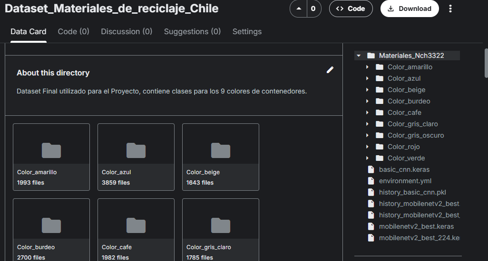

# Clasificación de Materiales Reciclables en Chile / Recyclable Material Classification in Chile

🇪🇸 Este proyecto desarrolla un modelo de clasificación de materiales reciclables en Chile utilizando imágenes y el sistema de colores de la norma NCh3322. Se emplea Transfer Learning (MobileNetV2) junto con técnicas de data augmentation para mejorar la capacidad de generalización. Se compararon varios modelos y se seleccionó el que obtuvo el mejor desempeño en validación. Para más detalles, revisar el notebook [`Clasificación_de_materiales_de_reciclaje_Chile_es.ipynb`](https://github.com/forxinrange0100/Clasificacion_de_materiales_de_reciclaje_Chile/blob/main/Clasificación_de_materiales_de_reciclaje_Chile_es.ipynb).

🇬🇧 This project develops an image-based classification model for recyclable materials in Chile, using the NCh3322 color-coded recycling standard. Transfer Learning (MobileNetV2) and data augmentation techniques were applied to improve model generalization. Several models were compared, and the best-performing one was selected based on validation results. See the notebook [`Recycling_Materials_Classification_Chile_en.ipynb`](https://github.com/forxinrange0100/Clasificacion_de_materiales_de_reciclaje_Chile/blob/main/Recycling_Materials_Classification_Chile_en.ipynb) for a full walkthrough.

## Modelos / Models

| Modelo / Model         | Archivo del modelo / Model File | Historia de entrenamiento / Training History |
| ---------------------- | ------------------------------- | -------------------------------------------- |
| CNN Básico / Basic CNN | `basic_cnn.keras`               | `history_basic_cnn.pkl`                      |
| MobileNetV2 (128x128)  | `mobilenetv2_best.keras`        | `history_mobilenetv2_best.pkl`               |
| MobileNetV2 (224x224)  | `mobilenetv2_best_224.keras`    | `history_mobilenetv2_best_224.pkl`           |

## Reproducir el entorno / Reproduce the Environment

```bash
conda env create -f environment.yml
conda activate reciclaje
```

🇪🇸 El archivo `Materiales_Nch3322.zip` contiene el dataset listo para entrenar.
Los Dataset y Archivos de modelos se encuentran en Kaggle.

🇬🇧 The file `Materiales_Nch3322.zip` contains the dataset ready for training.
The datasets and model files are available on Kaggle.



## Licencia / License

Este proyecto se distribuye bajo la licencia MIT.  
This project is released under the MIT License.
